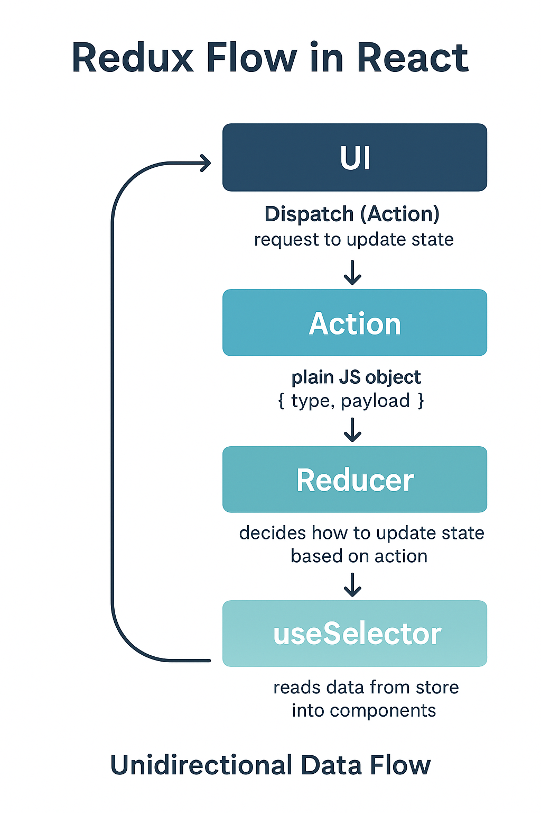

# 📘 Day 93 – React: Redux Basics
## 1. 🌟 What is Redux?

- **Redux** = A state management library for JavaScript applications.

- It helps manage **global state** (data shared across multiple components).

- Uses the principle of **Single Source of Truth** → all global state is stored in one central Store.

---

## 2. ⚖️ Redux vs Redux Toolkit

### Redux (Core Redux):

- Traditional way, needs more boilerplate code (actions, reducers, constants).

- Manual setup of store & middleware.

### Redux Toolkit (RTK):

- Modern, official, recommended approach.

- Reduces boilerplate.

- Uses **createSlice**, **configureStore**, etc.

- Cleaner, faster, beginner-friendly.

---

### 3. 🕰️ When to Use Redux?

Use Redux when:

- State is **large** and used by many components.

- Data needs **consistent global access**.

- Complex **updates / async calls (API fetch, CRUD)** are involved.

- Debugging / predictable state flow is needed.

---

### 4. 🤔 Why Redux when `useContext` exists?

- `useContext` can also share state globally, but:

    - Context is good for **small apps / light state sharing.**

    - Becomes inefficient when app grows **→ re-renders all consumers unnecessarily.**

    - Redux has **dev tools, middleware, time-travel debugging, and better performance** handling.

    👉 So, use **Context for small scale, Redux for large scale.**

---

### 5. 🔄 Redux Data Flow in React

1. **UI** → (user clicks, inputs, etc.)

2. **Dispatch(Action)** → request to update state.

3. **Action** → plain JS object (`{ type, payload }`).

4. **Reducer (or Slice)** → decides how to update state based on action.

5. **Store** → holds the updated state.

6. **useSelector** → reads data from store into components.

7. UI updates automatically when store changes.

    📌 This is called **Unidirectional Data Flow**.

---

## 6. 🧩 Key Redux Concepts
### a) Store

- The **container** that holds the global state.

- Only **one store** in an app.

### b) Action

- A plain JS object describing what happened.

- Example: `{ type: "ADD_TODO", payload: "Buy milk" }`.

- **Where used?** → Dispatched from components.

- **Work?** → Sent to Reducer to update state.

### c) Reducer

- A **pure function** that takes (`state, action`) → returns **new state.**

- **Work?** Decides how state changes.

- **Connects to Store.**

### d) Slice (Redux Toolkit)

- Combines **state + reducers + actions** in one place.

- Created using `createSlice`.

- Example: `todoSlice` (handles all todo logic).

### e) useSelector

- A React hook from Redux.

- **Reads data from store** into a component.

- Example:
```js
const todos = useSelector((state) => state.todo.todos);
```
### f) Dispatch

- A function to send actions to the store.

- Example:
```js
const dispatch = useDispatch();
dispatch(addTodo("Buy milk"));
```

### g) Subscribers

- Functions/components that **listen** to store changes.

- In React, `useSelector` acts as a **subscriber** (auto re-renders when store updates).

---

### 7. 🛠️ CRUD with Redux

- **Create (Add):** Dispatch `addAction(payload)`.

- **Read (Show):** use `useSelector` to fetch data from store.

- **Update:** Dispatch `updateAction(payload)`.

- **Delete:** Dispatch `deleteAction(id)`.

👉 Reducer/Slice updates store accordingly, and components re-render.

--- 

### 8. 📝 Quick Workflow Example (with RTK)
```js
// 1. Create Slice
const todoSlice = createSlice({
  name: "todo",
  initialState: { todos: [] },
  reducers: {
    addTodo: (state, action) => { state.todos.push(action.payload); },
    removeTodo: (state, action) => { state.todos = state.todos.filter(t => t.id !== action.payload); }
  }
});

// 2. Export actions
export const { addTodo, removeTodo } = todoSlice.actions;

// 3. Configure Store
const store = configureStore({ reducer: { todo: todoSlice.reducer } });

// 4. In Component
const todos = useSelector((state) => state.todo.todos);
const dispatch = useDispatch();
dispatch(addTodo({ id: 1, text: "Buy milk" }));
```

---

### 9. 🔑 Super-Quick Summary (Exam/Interview Ready)

- **Redux** = State management library.

- **Redux Toolkit** = Simplified Redux (recommended).

- **When to use?** → Large apps, complex state, multiple components share same data.

- **Why not just useContext?** → Context is small-scale, Redux is scalable with better tools.

- **Redux flow** = UI → Dispatch(Action) → Reducer → Store → useSelector → UI update.

- **Key terms:** Store, Action, Reducer, Slice, Dispatch, useSelector, Subscribers.

- **CRUD** = via dispatching actions that reducer handles.



